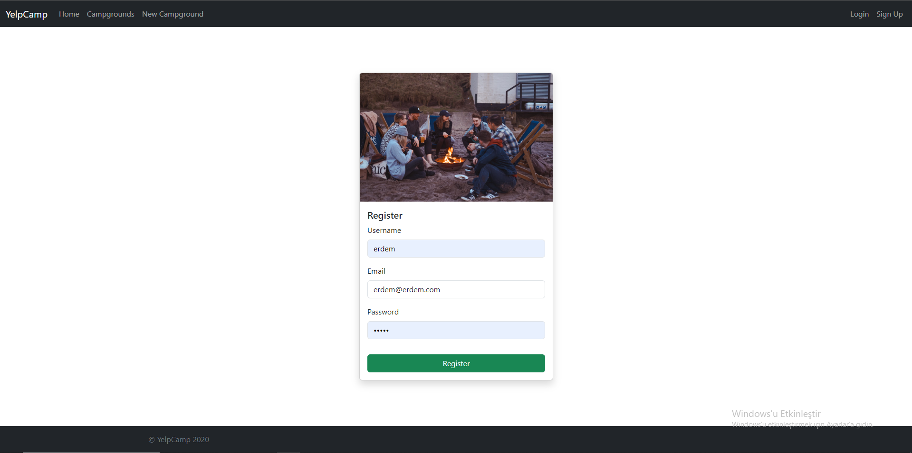
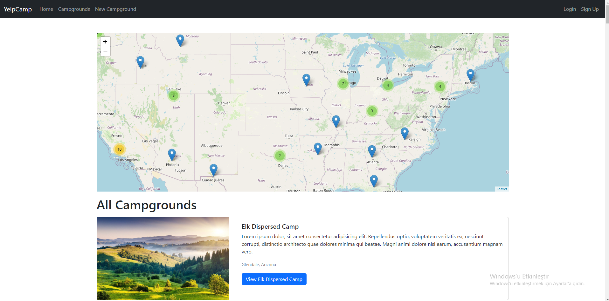
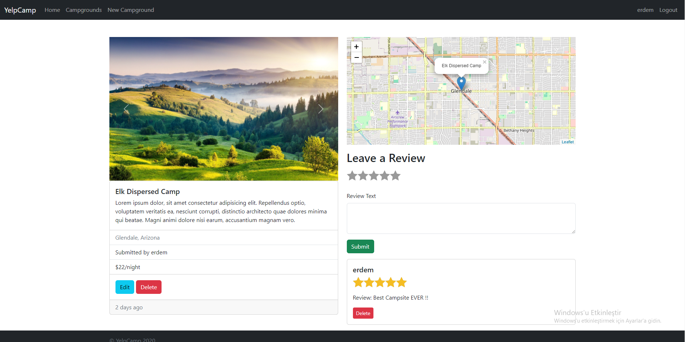
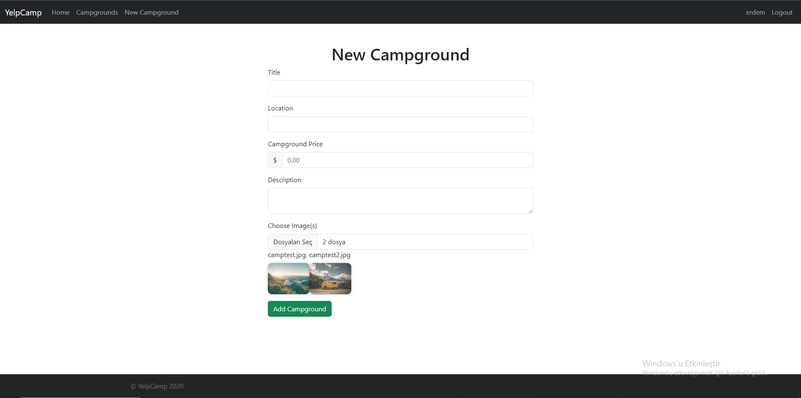
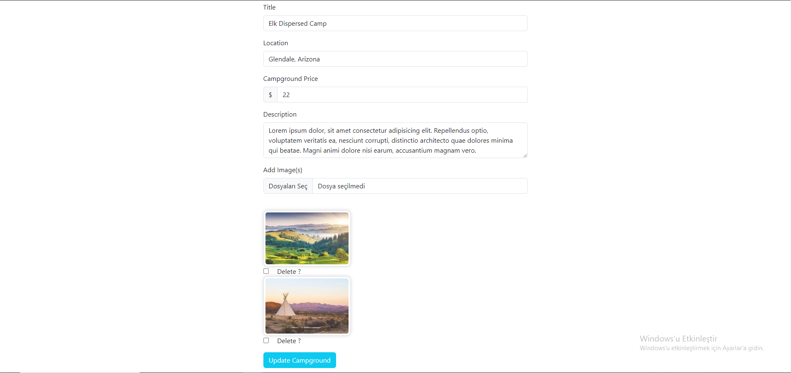

# YelpCamp

A campground site created using EJS templates , Express JS and MongoDB

## Links

### Project-Demo-Link -- https://yelpcamp-sc47.onrender.com

### Project-Overview-Video -- https://youtu.be/9bHKsMg3WO8

## Project

The frontend of this project is created with EJS Templates.  
To start the project:  

`npm install` 
`npm run seedDB` 
`npm run dev` 

### Screenshots

#### Home Page:

#### Signup Page:

#### Login Page:

#### All Campgrounds Page:

#### Campground View Page:

#### New Campground Page:

#### Edit Campground Page

